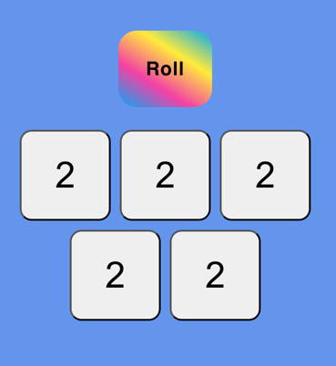

# Yahtzee
Utility for rolling dice



## Develop

```bash
npm i
npm start
```

## Future ideas
- make dice look more dice like
- add a counter of rolls
- make it a full multi-player game and keep score

## Credits
- This project was bootstrapped with [Create React App](https://github.com/facebook/create-react-app)
- Thanks [Naini Yashwanth](https://uiverse.io/Yashwanthnaini/dry-panther-24) for "roll" button css
